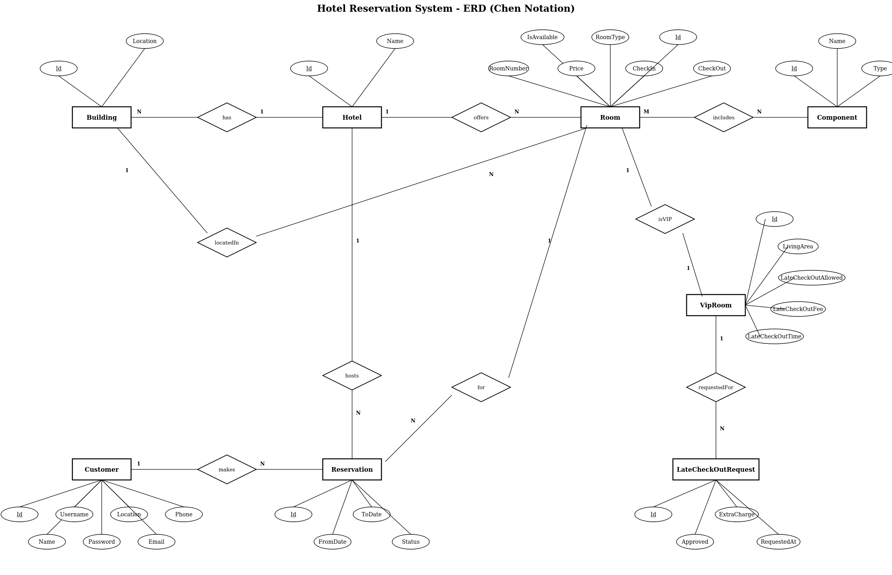

# 🏨 Hotel Reservation System

> A team-built hotel reservation backend developed with **ASP.NET Core 8 Web API**, **Entity Framework Core**, **SQL Server**, and **JWT authentication**.

[](https://dotnet.microsoft.com/)
[](https://learn.microsoft.com/aspnet/core/)
[](https://learn.microsoft.com/ef/core/)
[](https://www.microsoft.com/sql-server)
[](https://jwt.io/)
[](https://swagger.io/)

---

## 📌 Overview

The **Hotel Reservation System** is a backend Web API for managing the main operations of a hotel reservation workflow.

The system models:

- Hotels and their buildings
- Standard and VIP rooms
- Room availability and date ranges
- Customers and their profiles
- Reservations and reservation status
- Room components/amenities
- VIP-room services
- Late-checkout requests
- Authentication, authorization, access tokens, and refresh tokens

The project was developed as a **team project**, with the different modules integrated into the `team-final-integration` branch.

---

## 🎯 Project Goals

The project was designed to provide a structured API for:

1. Managing hotel and building data.
2. Managing standard and VIP rooms.
3. Checking room availability for a requested date range.
4. Creating, updating, and cancelling reservations.
5. Managing customer information securely.
6. Supporting role-based authentication and authorization.
7. Providing additional VIP-room functionality such as services and late checkout.
8. Persisting the domain model using SQL Server and Entity Framework Core.

---

## ✨ Main Features

### 🔐 Authentication & Authorization

The API includes:

- Customer registration
- Login
- JWT access tokens
- Refresh tokens
- Logout
- Password hashing
- Role-based authorization policies

The current application defines `AdminOnly` and `CustomerOnly` authorization policies.

### 🏨 Hotel & Building Management

Hotel and building endpoints support standard CRUD operations, including protection against deleting records that still have related data.

### 🛏️ Room Management

The system supports:

- Standard rooms
- VIP rooms
- Room creation/update/deletion
- Room lookup
- Room availability checks
- Room components/amenities
- VIP-room services

### 📅 Reservations

Reservations include:

- Check-in date
- Check-out date
- Customer
- Hotel
- Room
- Reservation status

The API supports creating, updating, retrieving, checking available reservations, and cancelling reservations.

### ⭐ VIP Room Services

VIP rooms expose additional functionality for:

- Retrieving VIP-room services
- Requesting late checkout
- Handling late-checkout related information

---

## 🧱 System Architecture

The application follows a layered Web API structure centered around ASP.NET Core:

```text
Client
  │
  ▼
ASP.NET Core Controllers
  │
  ├── Authentication / Authorization
  ├── Model Validation Filters
  ├── Request Timing Filter
  └── Custom Middleware
  │
  ▼
Application Services
  │
  ├── HotelService
  ├── BuildingService
  ├── ComponentService
  ├── ReservationService
  ├── StandardRoomServices
  ├── VipRoomService
  └── AuthService
  │
  ▼
Entity Framework Core
  │
  ▼
SQL Server
```

### Cross-cutting concerns

The project also contains custom handling for:

- Exception handling
- Validation errors
- Business exceptions
- Request logging
- Request timing
- Rate limiting
- JWT authentication
- Authorization policies

---

## 🧩 Domain / System Design

The original team design was created before implementation and describes the main domain objects and their relationships, including:

- `Hotel`
- `Building`
- `IRoom`
- `standardRoom`
- `vipRoom`
- `Reservation`
- `standardReservation`
- `vipReservation`
- `Customer`
- `Component`

The original design document is preserved as part of the project documentation.

> **Design source:** the class/domain diagram supplied by the team.

---

## 🗄️ Database Design

The database is implemented using **SQL Server** and **Entity Framework Core**.

The main relational model contains:

```text
Hotel
  │
  ├── Building
  │      │
  │      └── Room
  │             │
  │             └── RoomComponent ─── Component
  │
  └── Reservation ─── Customer
              │
              └── Room
```

### Main tables

| Table | Purpose |
|---|---|
| `Hotel` | Stores hotel information |
| `Building` | Stores buildings belonging to hotels |
| `Room` | Stores room information, pricing, availability and type |
| `Component` | Stores room components/amenities |
| `RoomComponent` | Resolves the room/component many-to-many relationship |
| `Customer` | Stores customer profile information |
| `Reservation` | Stores reservation dates, status and related customer/room/hotel |
| `Users` | Stores authentication credentials and roles |

### Relational schema

The project already contains the team's implemented ERD:



The repository also includes the SQL schema and sample data:

- [`Schema/HotelReservationSystem.sql`](Schema/HotelReservationSystem.sql)
- [`Schema/HotelReservationData.sql`](Schema/HotelReservationData.sql)

---

## 🔌 API Modules

The current project exposes API controllers for the main system modules:

| Controller | Responsibility |
|---|---|
| `AuthController` | Register, login, refresh token, logout |
| `HotelController` | Hotel CRUD |
| `BuildingController` | Building CRUD |
| `ComponentController` | Room component management |
| `CustomerController` | Authenticated customer profile access/update |
| `ReservaController` | Reservation management and availability |
| `StandardRoomController` | Standard-room management and availability |
| `VipRoomController` | VIP rooms, services and late checkout |

Swagger/OpenAPI is configured for API exploration during development.

---

## 🛡️ Security

Authentication is implemented using **JWT Bearer tokens**.

The authentication flow includes:

```text
Register
   │
   ▼
Password Hashing
   │
   ▼
Login
   │
   ├── Access Token
   └── Refresh Token
          │
          ▼
     Token Refresh
```

Customer endpoints are protected with authorization and verify that the authenticated user owns the requested customer profile.

> **Security note:** production deployments should keep signing keys and database credentials outside source control, for example through environment variables or a secure secret store.

---

## 🧪 Validation & Error Handling

The project contains dedicated components for handling application errors and validation, including:

- Model validation
- Business exceptions
- Global exceptions
- Unauthorized access
- Not-found cases
- Conflict cases
- Bad requests

Custom middleware is also used for exception handling, request logging, and rate limiting.

---

## 🛠️ Technology Stack

| Technology | Usage |
|---|---|
| **C#** | Main programming language |
| **.NET 8** | Application runtime |
| **ASP.NET Core Web API** | HTTP API framework |
| **Entity Framework Core 8** | ORM/data access |
| **SQL Server** | Relational database |
| **JWT Bearer** | Authentication |
| **Swagger / Swashbuckle** | API documentation |
| **EF Core Migrations** | Database versioning |

---

## 📁 Project Structure

```text
Hotel_Reservation_System/
│
├── Schema/
│   ├── HotelReservationSystem.sql
│   └── HotelReservationData.sql
│
├── Train_Project/
│   ├── Authentication/
│   ├── Controllers/
│   ├── DTOs/
│   ├── Data/
│   │   ├── Configurations/
│   │   └── Migrations/
│   ├── Entities/
│   ├── Exception/
│   ├── Filters/
│   ├── Handlers/
│   ├── Middleware/
│   ├── Services/
│   │   └── Interfaces/
│   ├── Program.cs
│   └── Train_Project.csproj
│
├── HotelReservationSystem.sql
├── HotelReservationData.sql
├── HotelReservationSystem_ERD.png
└── Train_Project.slnx
```

---

## 🚀 Getting Started

### Prerequisites

Install:

- [.NET 8 SDK](https://dotnet.microsoft.com/download/dotnet/8.0)
- SQL Server
- Visual Studio 2022 / Rider / VS Code
- A REST client such as Swagger UI or Postman

### 1. Clone the repository

```bash
git clone https://github.com/Gemy21/Hotel_Reservation_System.git
cd Hotel_Reservation_System
```

### 2. Configure SQL Server

The project currently expects a SQL Server connection through:

```text
DefaultConnection
```

in `Train_Project/appsettings.json`.

Update the connection string for your local SQL Server instance before running the application.

### 3. Create the database

You can use the SQL scripts in:

```text
Schema/HotelReservationSystem.sql
Schema/HotelReservationData.sql
```

Alternatively, use the Entity Framework Core migrations included in the project.

### 4. Run the API

```bash
cd Train_Project
dotnet restore
dotnet run
```

When running in Development mode, Swagger UI is enabled.

The launch settings in the project define the development HTTP/HTTPS profiles.

---

## 📸 Screenshots

### Application screenshots

This README intentionally does **not** use generated/mock application screenshots.

The repository currently contains the implemented API and database/design artifacts, but no committed UI screenshots of the running application. Real screenshots from the running project should be added here once the team provides/captures them.

Suggested screenshots to add:

- Swagger endpoint overview
- Authentication / login request
- Room availability request
- Reservation creation
- VIP-room services / late-checkout request
- Database view

### Design artifacts

The project documentation should also include the team's original system/domain design and relational database design alongside the implemented ERD.

---

## 👥 Team

This project was developed collaboratively.

**Team members will be listed here with their GitHub usernames once the final team list is provided.**

| Member | GitHub |
|---|---|
| _To be added_ | _To be added_ |
| _To be added_ | _To be added_ |
| _To be added_ | _To be added_ |
| _To be added_ | _To be added_ |

---

## 📚 Project Documentation

| Resource | Description |
|---|---|
| [`HotelReservationSystem_ERD.png`](HotelReservationSystem_ERD.png) | Implemented database ERD |
| [`Schema/HotelReservationSystem.sql`](Schema/HotelReservationSystem.sql) | Database schema |
| [`Schema/HotelReservationData.sql`](Schema/HotelReservationData.sql) | Sample database data |
| [`Train_Project/`](Train_Project/) | ASP.NET Core Web API implementation |

---

## 🤝 Team Collaboration

The project was developed as a shared team codebase. The final integration branch is:

```text
team-final-integration
```

Each module was integrated into the final backend so that authentication, hotel/building management, room management, reservations, customers, components, and VIP functionality work as parts of the same system.

---
